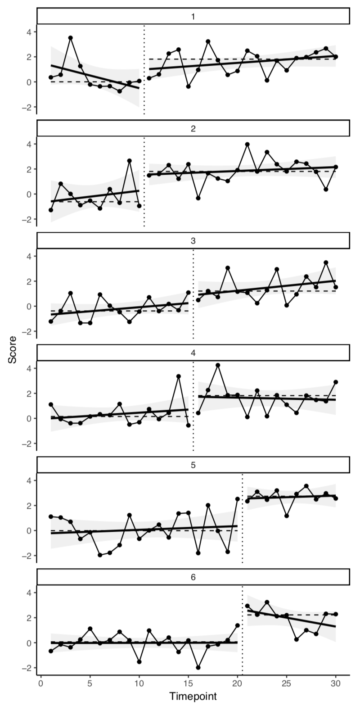

# SCED

An R package for analysis of AB Single Case Experiment Design data using [exact tests](https://en.wikipedia.org/wiki/Exact_test) and [robust effect sizes](https://www.ncbi.nlm.nih.gov/pubmed/18331151).

## Author

Ian Hussey (ian.hussey@ugent.be)

## License

GPLv3+

## Installation

```R
install.packages("devtools")
library(devtools)
install_github("ianhussey/SCED")
library(SCED)
```

## Main functions 

### sced_plot(data)

Separate conditions A and B for each each participant. Linear regression lines and error bars are included to make trends within and between conditions more apparent. 



### sced_analysis(data)

Calculates the following statistics:

- An exact *p* value for using a non-paramteric permutation test (via the coin package). These are insensitive to distributions and outliers. False positive rates are therefore equal to the alpha value, rather than approximate to it. Assesses whether the values of the data points in condition B are different to condition A.
- Effect size *A* ([Ruscio, 3008](https://www.ncbi.nlm.nih.gov/pubmed/18331151)), a non-parametric, probabalistic effect size. This is also calculated via a permutation method, and is therefore robust/insensitive to outliers and distributions. The original, parametric versions of this test are referred to as the Area Under the Curve (AUC), the Common Language Effect Size (CLES), or the probability of superiority. *A* has an identical range (i.e. a probability between and 1) interpretation (i.e., the probability of a randomly selected time point in condition B being greater than a randomly selected time point in condition A). *A* is therefore also more robust than traditional effect size metrics for SCED such as the % overlap and the % greater than the median.
- Hedges' *g* effect sizes are also calculated for the sake of familiarity/comparison. However, these are sensitive to the ratio of data points in A vs. B, the distributions of data in each condition, and the equality of variances of A and B. 

### simulate_ab_data(data)

Simulate data that meets the required format of sced_analysis() and sced_plot(), using the simstudy package.


## To do

- *p* value formatting needs attention: sometimes rounds, but sometimes reports scientific abbreviations.
- Include analysis information in the plots?